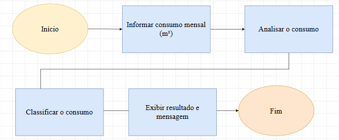

# 💧 Classificação de Consumo de Água


## 📌 Sobre o Projeto

Este projeto foi desenvolvido como parte da **Agenda 07 da disciplina de Desenvolvimento de Sistemas I**, do curso técnico de **Desenvolvimento de Sistemas da ETEC Rubens de Faria e Souza**.

A proposta simula uma ação de conscientização ambiental realizada por uma companhia de saneamento. O sistema recebe o **consumo mensal de água de um imóvel, em metros cúbicos (m³)**, classifica o perfil de consumo e apresenta uma mensagem educativa ao usuário.

## 🎯 Objetivo

O principal objetivo do programa é aplicar conceitos básicos de programação para:

* Receber o consumo mensal de água informado pelo usuário;
* Analisar o valor de consumo;
* Classificar o perfil de consumo;
* Exibir uma mensagem de conscientização;
* Incentivar o uso responsável da água.

## ⚙️ Funcionamento

O programa solicita ao usuário o consumo mensal de água do imóvel em **m³**.

A partir do valor informado, o sistema utiliza estruturas condicionais para identificar a faixa de consumo correspondente e apresentar a classificação e a orientação adequada.

### 🔄 Fluxo do Programa

Lógica da Aplicação

O funcionamento do sistema pode ser representado pelo seguinte fluxo:



## 🧠 Conceitos de Programação Utilizados

Durante o desenvolvimento foram aplicados conceitos fundamentais da linguagem Python, como:

* Variáveis;
* Entrada de dados com `input()`;
* Conversão de tipos;
* Estruturas condicionais `if`, `elif` e `else`;
* Operadores relacionais;
* Saída de dados com `print()`;
* Formatação de mensagens.

## 🛠️ Tecnologias Utilizadas

| Tecnologia   | Utilização                              |
| ------------ | --------------------------------------- |
| **Python 3** | Desenvolvimento do sistema              |
| **Git**      | Controle de versão                      |
| **GitHub**   | Armazenamento e documentação do projeto |

## 🚀 Como Executar

### Pré-requisitos

É necessário ter o **Python 3** instalado na máquina.

### Execução

1. Clone este repositório ou faça o download dos arquivos.
2. Abra o terminal na pasta do projeto.
3. Execute o arquivo principal:

```bash
python app.py
```

4. Informe o consumo mensal de água solicitado pelo programa.
5. Confira a classificação e a mensagem apresentada pelo sistema.

## 📂 Estrutura do Projeto

```text
classificacao-consumo-agua/
│
├── app.py
└── README.md
```

## 🌱 Sustentabilidade

Além de aplicar conceitos de programação, o projeto aborda a importância do **consumo consciente de água**.

A classificação apresentada pelo sistema possui caráter educativo e busca incentivar a reflexão sobre os hábitos de consumo e a preservação desse recurso natural.

## 📚 Contexto Acadêmico

**Curso:** Técnico em Desenvolvimento de Sistemas

**Instituição:** ETEC Rubens de Faria e Souza

**Disciplina:** Desenvolvimento de Sistemas I

**Atividade:** Agenda 07 — Classificação de Consumo de Água

**Linguagem:** Python

**Professor:** 	PAULO EDUARDO CARDOSO ANDRADE

---

💧 **"A água é matéria e matriz da vida, mãe e meio. Não há vida sem água."— (Albert Szent-Gyorgyi)**
